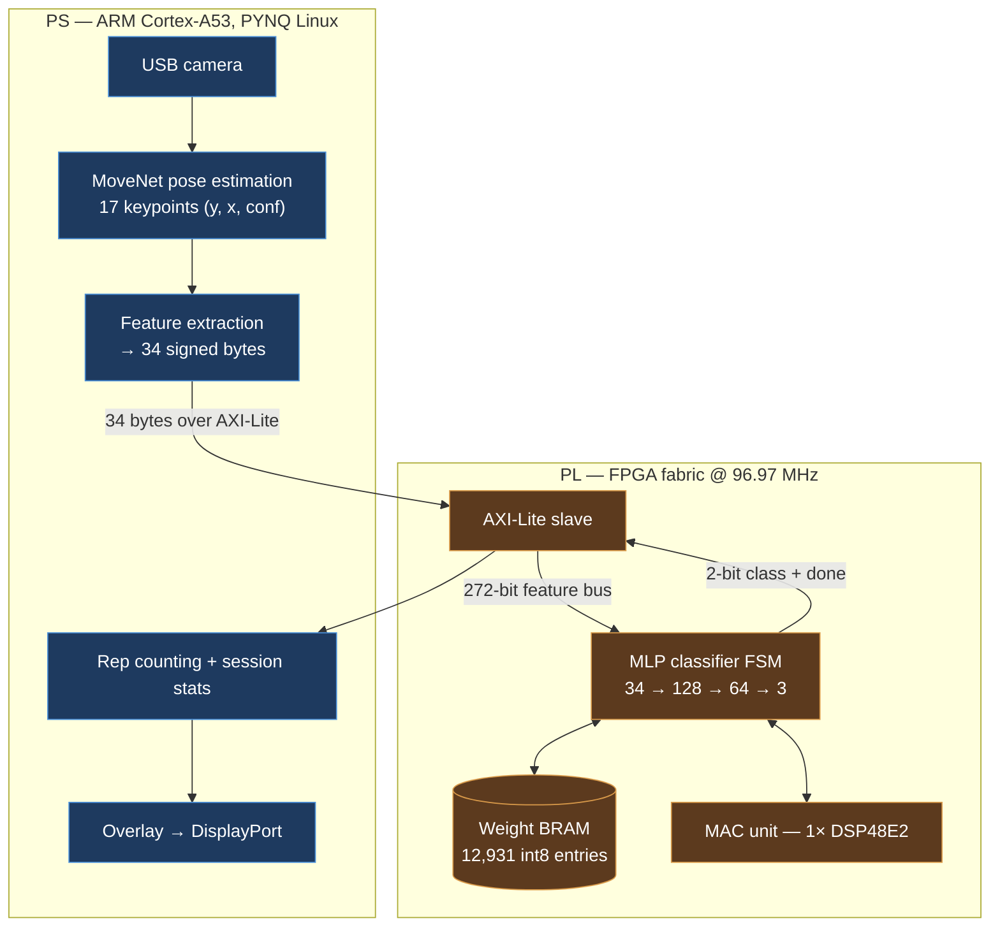

# Flex-PGA — on-device workout classification on a Zynq UltraScale+ FPGA

Real-time exercise recognition and rep counting from a live camera feed, with pose
estimation and a quantized neural-network classifier running entirely on-device —
no cloud, no GPU, no video ever leaving the board.



## The problem

Consumer fitness trackers either run computer vision on a phone CPU — where
thermal throttling and OS scheduling cause dropped frames and missed reps — or
ship live video of your home to a server, which adds round-trip latency that
breaks real-time feedback and creates a permanent record of a private activity.
Neither is a good fit for something that has to watch you exercise.

Doing the inference on-device removes both problems at once: feedback latency is
bounded by hardware rather than by a network, and the video never leaves the
board. Only 34 bytes of anonymized keypoint coordinates ever cross a bus.

## Machine learning

### Pose estimation — MoveNet

Each frame is fed to **MoveNet**, a pretrained single-person pose estimation
model, which returns **17 keypoints** as `(y, x, confidence)` triples normalized
to `[0, 1]`. Using a pretrained pose model rather than training a classifier on
raw pixels is the key architectural decision in the project: it reduces a
frame — hundreds of thousands of pixels — to 34 numbers that already encode body
geometry, and it makes the downstream classifier small enough to fit in FPGA
fabric with room to spare.

It also makes the system inherently privacy-preserving. Once pose estimation has
run, the pixels are discarded; everything downstream operates on skeleton
coordinates.

Pose estimation runs on the PS. It was intended to run in fabric on a hardware
DPU — the story of why it doesn't is [below](#the-dpu-that-didnt-fit).

### Workout classification

Keypoints feed a small **multi-layer perceptron** that classifies the current
pose into one of four states:

```
34 inputs  →  128 (ReLU)  →  64 (ReLU)  →  3  →  argmax  →  push-up | squat | curl | no pose
[17 kp × (y,x)]
```

Confidence values are dropped and the coordinate pairs are flattened into a
34-element vector. The output layer has three neurons; the fourth class, "no
pose," is emitted when no neuron strictly dominates the other two — so an
ambiguous frame degrades to an explicit non-answer instead of a confident wrong
one.

### Quantization

The trained model was converted from 32-bit float to **8-bit signed fixed point**
so it could live in fabric. This is what makes the hardware implementation
tractable:

- **Weights become BRAM-resident.** All 12,931 weights and biases fit in a single
  on-chip BRAM instance (1.62% of the device's block RAM), so the accelerator
  never touches DDR and never stalls on external memory.
- **Multiplies become one DSP slice.** An 8×8 multiply accumulated into 21 bits
  maps directly onto a single `DSP48E2` primitive. A float32 equivalent would
  need several slices and far deeper pipelining.
- **Activations stay integral.** ReLU is a sign check on the accumulator, not a
  separate arithmetic stage.

The measured cost of quantization was an accuracy drop, recovered by tuning
classification thresholds in PS-side post-processing. Final accuracy: **90%**
against a >85% target.

## Hardware implementation

**Target:** Xilinx Zynq UltraScale+ **XCZU3EG** (`xczu3eg-sfvc784-2-e`), AUP-ZU3
board, PYNQ Linux. Vivado 2025.2.

The classifier is a hand-written SystemVerilog IP core packaged as an AXI-Lite
peripheral. `mlp_classifier.sv` is a 17-state FSM that sequences the network:
fetch bias, fetch the neuron's weights, run the multiply-accumulate chain, apply
ReLU, advance. `weight_bram_ctrl.sv` computes BRAM addresses from a
`(layer, neuron, input)` triple, and `mac.sv` wraps a single `DSP48E2` as an
8×8 + 20 → 21-bit MAC with a valid shift register tracking pipeline latency.

**Resource utilization and timing (final design):**

| Metric | Value |
|---|---|
| PL clock | 96.97 MHz (10.312 ns) |
| LUT / FF | 3.04% |
| Block RAM | 1.62% |
| DSP | 0.28% (1 of 360) |
| Power | 3 W total |

The footprint is deliberately small: a single sequential MAC at ~1 ms per
inference against a 100 ms frame budget left no reason to push the clock or
spend area on parallelism.

> Utilization and power for the final design are the team's reported figures.
> The routed Vivado reports preserved in [`vivado/reports/`](vivado/reports/) are
> from the DPU build described below, not this one — so the numbers in this table
> and the numbers in those files describe two different designs.

### The DPU that didn't fit

Pose estimation was meant to run in fabric on a Xilinx **DPUCZDX8G** deep-learning
processor, with the PS reduced to a camera driver. That design was built and
implemented — and it consumed the entire device:

| Resource | Used | Available | Utilization |
|---|---:|---:|---:|
| CLB | 8,818 | 8,820 | **99.98%** |
| DSP | 343 | 360 | **95.28%** |
| LUT | 56,622 | 70,560 | 80.25% |
| Block RAM | 168.5 | 216 | 78.01% |

That build routed and **closed timing** — WNS +14.145 ns, TNS 0.000, all
constraints met at 96.97 MHz — so it was not a timing failure. It was an area
failure: at 99.98% CLB occupancy nothing else could be placed alongside the DPU,
and each synthesis iteration took hours. Pose estimation moved to the PS and the
fabric was given the workload it was actually well suited to. The routed reports
are in [`vivado/reports/`](vivado/reports/).

This is the project's central engineering result, and both halves are measured on
real silicon.

## Results

| Metric | Target | Achieved |
|---|---|---|
| Throughput | 15 FPS | **10 FPS** |
| Classification accuracy | >85% | **90%** |
| Power | <5 W | **3 W** |
| Rep-counting error | <5% | 15% |

The FPS shortfall and the rep-counting error are both PS-side. The fabric
classifier consumes roughly 1% of the per-frame budget; the system is bounded by
pose estimation on the ARM cores, which is precisely the workload the DPU was
meant to absorb. Rep counting is a threshold-based state machine in Python with
no temporal smoothing, and 15% error reflects that.

## Tech stack

**Hardware:** Xilinx Zynq UltraScale+ XCZU3EG · Vivado 2025.2 · SystemVerilog /
Verilog · AXI4-Lite · DSP48E2 · Block RAM

**Software:** Python 3 · PYNQ · OpenCV · NumPy · Vitis AI / VART (DPU
experiments)

**ML:** MoveNet (pretrained pose estimation) · custom MLP classifier · int8
post-training quantization

## Repository layout

```
ip/mlp_controller_1_0/      Packaged AXI-Lite IP — the classifier
  src/mlp_classifier.sv       ★ 17-state FSM: 34 → 128 → 64 → 3
  src/mac.sv                  ★ DSP48E2 multiply-accumulate wrapper
  src/weight_bram_ctrl.sv     ★ BRAM address generation
  src/*.coe                     int8 weights as BRAM initialization
  src/*/                        Block Memory Generator + DSP Macro (.xci)
  hdl/                          AXI-Lite slave — Vivado-generated wrapper
  example_designs/              Generated BFM testbench
  component.xml                 IP packaging metadata
software/                   PS-side Python
  pulse_monitor.py            ★ Main controller: capture → pose → AXI → class
  movenet_pose.py             ★ MoveNet inference + letterbox mapping
  push_buttons.py             ★ Button UI, rep tallies, leaderboard
  dpu-experiments/              VART/DPU bring-up (ResNet smoke test)
models/                     Pretrained MoveNet — download separately
vivado/                     Project sources — .xpr, block design, constraints
  reports/                      Routed utilization, timing, power (DPU build)
docs/                       Architecture, register map, final report, poster
```

★ marks hand-written work. The AXI-Lite slave under `ip/.../hdl/` is Vivado's
"Create and Package New IP" template — only the user-logic block at the end of
`mlp_controller_slave_lite_v1_0_S00_AXI.v` (register packing, start/done
handshake, classifier instantiation) is ours.

## Building

Vivado 2025.2 and a Zynq UltraScale+ ZU3EG board are required.

```bash
# 1. Open the project
vivado vivado/workout_classifier.xpr

# 2. Add the packaged classifier IP to the catalog, in the Tcl console:
#      set_property ip_repo_paths ./ip [current_project]
#      update_ip_catalog
#    then generate the block design, synthesize, implement, write bitstream.

# 3. Fetch the pretrained pose model (see models/README.md), then copy the
#    bitstream, .hwh, software/ and models/ to the board and run:
pip install tflite-runtime opencv-python-headless numpy
python3 software/pulse_monitor.py
```

To retrain the classifier, regenerate `ip/mlp_controller_1_0/src/all_weights.coe`
and rebuild — weights are baked into the BRAM at synthesis and are not writable
at runtime.

### Simulation

`ip/mlp_controller_1_0/example_designs/bfm_design/` holds the AXI BFM testbench
Vivado generates when packaging an IP. It exercises the bus interface, not the
classifier: it will confirm that reads and writes land in the right registers,
but it does not check that the network computes correct outputs.

There is no unit testbench for `mlp_classifier.sv`. The classifier was validated
in-system against known inputs rather than in simulation — worth knowing before
you go looking for a verification suite.

## Repository status

This is a cleaned-up capstone repository preserved as a portfolio piece.

- **The pose stage is a reconstruction.** The original team code ran MoveNet on
  the PS, but that implementation was not preserved.
  [`software/movenet_pose.py`](software/movenet_pose.py) is a working
  implementation of the same stage written after the fact against the public
  pretrained model — not original capstone code.
- **The PS/PL seam did not converge during the capstone.** The delivered PS
  controller produced 36 OpenPose-shaped features against RTL expecting 34
  MoveNet-shaped ones, with register offsets shifted to match. Both ends now
  agree, and the fixes are itemized in
  [docs/architecture.md](docs/architecture.md#known-gaps).
- **The results above are the team's measured numbers** from the final report,
  taken on the original design rather than on this cleaned-up tree. Figures
  quoted from routed Vivado reports are labeled as such where they appear.

Technical claims here are written from the RTL and the Vivado reports. Where the
submitted project report and the source disagree, the source is what this README
describes.

## Credits

**ECE 554 Senior Capstone, University of Wisconsin–Madison** — team Flex-PGA:
Sam Kaufman, Madi Licht, Ryan O'Sullivan, Holland Hargens, Prateek Tandon.
Original team repository: [Ryanos99/ECE554_Capstone](https://github.com/Ryanos99/ECE554_Capstone).

MoveNet is Google's pretrained pose estimation model, used off the shelf under
its own license. It was not trained or modified by this project.
