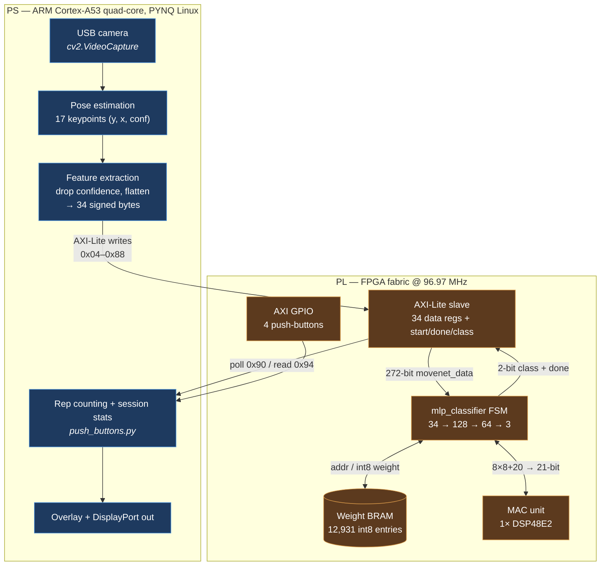

# Architecture — hardware/software split

This document describes what runs where, and why. It is written from the RTL and
the Vivado block design in this repository, not from the project proposal — where
the two disagree, the code wins. Claims that could not be verified against the
source are called out explicitly.

---

## Data path



---

## What runs where

| Stage | Runs on | Why |
|---|---|---|
| Camera capture | PS | UVC driver support is a Linux userspace concern. No fabric benefit. |
| Pose estimation | **PS** | MoveNet, pretrained and used off the shelf. Intended for the PL via a Xilinx DPU; the DPU did not fit — see below. |
| Feature extraction | PS | 34 values per frame; trivially cheap next to the pose model. |
| MLP classification | **PL** | Fixed topology, int8 weights, no control flow — a good fabric fit. |
| Rep counting | PS | The classifier is stateless; temporal logic lives in Python. |
| Session stats / UI | PS | String handling and display composition. |

---

## Why the pose model runs on the PS

The original design put pose estimation in the fabric on a Xilinx DPU
(`DPUCZDX8G`), with the PS acting only as a camera driver and display
controller. That path was built and implemented, and it is the reason the
project targets a Zynq SoC at all.

It did not fit. The implementation run preserved in
[`vivado/reports/`](../vivado/reports/) is from a design containing a **B2304**
DPU core (`ARCH=2304`, ICP/OCP 12, PP 8) on the ZU3EG:

| Resource | Used | Available | Utilization |
|---|---:|---:|---:|
| CLB | 8,818 | 8,820 | **99.98%** |
| DSP | 343 | 360 | **95.28%** |
| CLB LUTs | 56,622 | 70,560 | 80.25% |
| Block RAM | 168.5 | 216 | 78.01% |

The design routed and closed timing, but at 99.98% CLB occupancy there was no
room left for the classifier, the GPIO, or any future logic — and each synthesis
iteration took hours, which made the debug loop impractical inside a semester.
The team pivoted: pose estimation moved to the PS, and the fabric was given the
part of the workload it is genuinely good at — a small, fixed, quantized
classifier.

The final design's footprint is the other end of the scale:

| Resource | Utilization |
|---|---:|
| LUT / FF | 3.04% |
| Block RAM | 1.62% |
| DSP | 0.28% |

Both sets of numbers are real measurements of the same board, and together they
are the clearest statement of the tradeoff the project actually made.

---

## The classifier in fabric

`mlp_classifier.sv` is a 17-state FSM that walks a three-layer perceptron:

```
34 inputs → 128 (ReLU) → 64 (ReLU) → 3 → argmax → 2-bit class
```

- **Weights** are 8-bit signed, held in a single-port BRAM initialized from
  [`ip/mlp_controller_1_0/src/all_weights.coe`](../ip/mlp_controller_1_0/src/all_weights.coe) at bitstream
  build time. The layout is laid out by `weight_bram_ctrl.sv`:

  | Region | Entries | Address range |
  |---|---:|---|
  | Layer 1 weights (34 × 128) | 4,352 | `0x0000`–`0x10FF` |
  | Layer 2 weights (128 × 64) | 8,192 | `0x1100`–`0x30FF` |
  | Output weights (64 × 3) | 192 | `0x3100`–`0x31BF` |
  | Biases (128 + 64 + 3) | 195 | `0x31C0`–`0x3282` |

- **Arithmetic** is a single `DSP48E2` macro (`mac.sv`) computing
  `acc_out = point × weight + acc_in` at 8×8 + 20 → 21 bits. Results are
  accumulated **sequentially**, one multiply per MAC visit, with a 3-deep valid
  shift register tracking DSP pipeline latency.

- **ReLU** is implemented by clamping negative accumulator values to zero as each
  neuron's result is registered — no separate activation stage.

- **The datapath stays 8 bits wide between layers.** Accumulators are 21 bits,
  but `point` — the value handed to the MAC — is `signed [7:0]`, so each layer's
  output is narrowed back to a byte before feeding the next. This is deliberate:
  holding full accumulator width across layers would widen the multiplier operand
  and cost more than the single DSP48E2 the design budgets for. The narrowing is
  a bare bit-select of `[7:0]` rather than a shift or saturate, so values beyond
  ±127 wrap rather than clip — the network's trained weight scale is what keeps
  activations in range.

- **Classification** is an argmax over the three output neurons. If no neuron
  strictly dominates, the FSM emits `2'b11` ("no pose"), which is how the fourth
  class arises from a three-neuron output layer.

### Throughput

The FSM is sequential, so one classification costs roughly

```
layer 1:  128 neurons × 34 inputs × (~3 cycle weight fetch + ~5 cycle MAC)  ≈  35k cycles
layer 2:   64 neurons × 128 inputs × (~3 + ~5)                              ≈  66k cycles
output:     3 neurons ×  64 inputs × (~3 + ~5)                              ≈   2k cycles
                                                                        total ≈ 100k cycles
```

At 96.97 MHz that is **on the order of 1 ms per classification** — roughly 1,000
inferences/second. This is an estimate derived from the state machine, not a
measured figure; no cycle-accurate benchmark was recorded.

The significance is the comparison: the system ran at **10 FPS**, or 100 ms per
frame. The fabric classifier accounts for about 1% of that budget. **The system
was bounded by pose estimation on the PS**, not by the accelerator — which is
also why the DPU was worth attempting in the first place.

---

## PS ↔ PL contract

A single AXI-Lite slave carries the whole interface. See
[register-map.md](register-map.md) for offsets.

The PS writes 34 feature bytes, pulses a start bit, then polls a done flag and
reads a 2-bit class. There is no AXI-Stream path and no DMA engine in the block
design — the payload is 34 bytes per frame, so 34 register writes are entirely
adequate and the added complexity would buy nothing.

Weights are **not** runtime-writable. The BRAM is instantiated single-port
(`clka`/`ena`/`addra`/`douta`), and its contents come from the `.coe` at
synthesis. Retraining the classifier requires regenerating the `.coe` and
rebuilding the bitstream.
